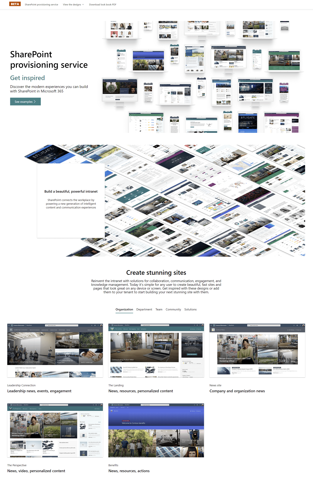

# SharePoint Provisioning Service

Code for the provisioning service hosted at http://provisioning.sharepointpnp.com. 

All the **SharePoint Look Book templates** hosted from this service are also open-sourced and are available from seperate [repository](https://github.com/SharePoint/sp-dev-provisioning-templates), which is the content source for the release information.

> Please be aware that **documentation work is still in progress** and we will keep on provide more guidance and input around covered capabilities in this solution. In the meantime, please submit issues and questions using the [issues list](../../issues) to help us provide better documentation and guidance. Thanks for your patience!

## Contributing

This project welcomes contributions and suggestions.  Most contributions require you to agree to a
Contributor License Agreement (CLA) declaring that you have the right to, and actually do, grant us
the rights to use your contribution. For details, visit https://cla.microsoft.com.

When you submit a pull request, a CLA-bot will automatically determine whether you need to provide
a CLA and decorate the PR appropriately (e.g., label, comment). Simply follow the instructions
provided by the bot. You will only need to do this once across all repos using our CLA.

This project has adopted the [Microsoft Open Source Code of Conduct](https://opensource.microsoft.com/codeofconduct/).
For more information see the [Code of Conduct FAQ](https://opensource.microsoft.com/codeofconduct/faq/) or
contact [opencode@microsoft.com](mailto:opencode@microsoft.com) with any additional questions or comments.

